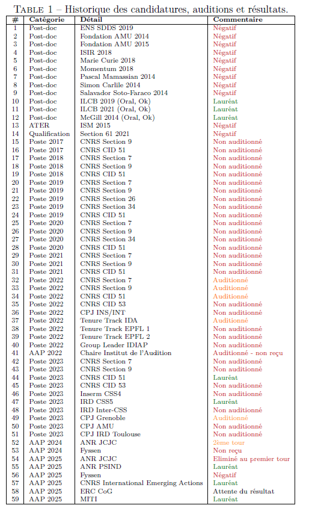

# Applying for grants

Although laboratories like the FEMTO-ST Institute (see [this](../../../about-the-lab/about-the-team-dept-and-institute/#about-labs-teams-and-groups) for the meaning of the word _laboratory_ in French academia) automatically get a yearly amount of research funding, that amount is quite limited (the order of a few €1,000 per person/year - pays for coffee, roughly) and most research in the French academic system is conducted on funding that individual researchers (or teams thereof) apply and compete for: _grants_. Such funding may be local/regional (e.g. Université Marie and Louis Pasteur has a number of schemes, such as _Chrysalide_), national (e.g. through [Agence Nationale de la Recherche](https://anr.fr/)), or european/international (e.g. [ERC](https://erc.europa.eu/homepage)), as come from both public or private entities (ex. Fondations such as [Fondation pour l'Audition](https://www.fondationpourlaudition.org/)). The smallest of these grants may fund a few €10,000 for e.g. travel and small equipment (taht's typically the case of binational programs such as [Partenariat Hubert Curien](https://www.campusfrance.org/fr/phc), which provides money for travel and workshops co-organized by labs from 2 different countries); mid-size grants ca. 150k€ may fund a PhD or postdoctoral fellowship (e.g. [Fondation Fyssen](https://www.fondationfyssen.fr/en/our-actions/study-grants/)), or a 3-4 year project with 2-3 hires (e.g. ANR projects are typically about 450-500k€ to be divided in 2-3 labs, co-applying as a _consortium_). Even larger multi-million grants like the ERC may fund a while 5-10 person team for 5+ years (at which point you'll find it easier to convince your PI that it is scientifically essential that your next team seminar is held in a sky resort, or wherenot). 

{ align=left; width=60% }

While many academic systems (e.g. US, Canada, etc.) require grad students to apply to their own grants to fund their PhDs or postdocs, French academia is relatively conservative (some would say protective) in requiring that most grant applications are done by permanent staff (researchers or professors) - with the exception of postdoctoral fellowships where it is quite customary that incoming postdocs first have to apply for a grant to cover their salary (if the lab they're going doesn't have their own funding, or cannot/don't want to use it for that). 

The process of writing (and obtaining) grant application is therefore an important part of the job, but before and after you secure a position. In the following, we gather tips for grant writing, as well as share some of our recent grant application documents for (positive, or negative) inspiration. 

## Examples of applications 

:white_check_mark: funded - :x: rejected - :watch:pending

- 2013: PEPS MAITRE [[proposal]](../../downloads/grants/PEPS_2013_MAITRE.pdf) :x:
- 2013: ERC StG (European Research Council) CREAM [[B1]](../../downloads/grants/ERC_StG_2013_CREAM_B1.pdf) [[B2]](../../downloads/grants/ERC_StG_2013_CREAM_B2.pdf) :white_check_mark:
- 2015: PEPS WARMER [[proposal]](../../downloads/grants/PEPS_2015_WARMER.pdf) :x:
- 2015: ANR (Agence Nationale de la Recherche) NAIMA [[short]](../../downloads/grants/ANR_2015_NAIMA_short.pdf)  :x:
- 2017: AAP Philharmonie DEMOS [[proposal]](../../downloads/grants/PHILHARMONIE_DEMOS_2017.pdf) :x:
- 2017: ANR (Agence Nationale de la Recherche) REFLETS [[short]](../../downloads/grants/ANR_2017_REFLETS_short.pdf) [[long]](../../downloads/grants/ANR_2017_REFLETS_long.pdf) :white_check_mark:
- 2018: PHRIP PROSAVC [[proposal]](../../downloads/grants/PHRIP_2018_PROSAVC.pdf) :white_check_mark:
- 2018: ERC Advanced (European Research Council) SOUNDS4COMA [[B1]](../../downloads/grants/ERC_ADV_2018_SOUNDS4COMA_B1.pdf) [[B2]](../../downloads/grants/ERC_ADV_2018_SOUNDS4COMA_B2.pdf) :x:
- 2018: IEA (International Emerging Action) NEWDEAL [[proposal]](../../downloads/grants/IEA_2018_NEWDEAL.pdf) :white_check_mark:
- 2018: ERC PoC (European Research Council) RESET [[proposal]](../../downloads/grants/ERC_POC_2018_RESET.pdf) :x:
- 2018: ANR (Agence Nationale de la Recherche) ORPHEUS [[short]](../../downloads/grants/ANR_2018_ORPHEUS_short.pdf) :x:
- 2019: ERC PoC (European Research Council) ACTIVATE [[proposal]](../../downloads/grants/ERC_POC_2019_ACTIVATE.pdf) :white_check_mark:
- 2019: Fondation pour l'Audition Bourse de thèse [[proposal]](../../downloads/grants/FPA_2019_THESE.pdf) :white_check_mark:
- 2019: ANR (Agence Nationale de la Recherche) SEPIA  [[long]](../../downloads/grants/ANR_2019_SEPIA_long.pdf) :white_check_mark:
- 2021: MSCA (Marie Sklodowska-Curie Actions) Doctoral Network LULLABYTE [[proposal]](../../downloads/grants/MSCA_DN_2021_LULLABYTE.pdf) :white_check_mark:
- 2021: JSPS (Japanese Soc. Promotion of Science) Postdoctoral Fellowship [[proposal]](../../downloads/grants/JSPS_2021_GUEROUAOU.pdf) :white_check_mark:
- 2021: Fondation pour l'Audition DASHES [[proposal]](../../downloads/grants/FPA_2021_DASHES.pdf) :white_check_mark:
- 2021: EIC Transition (European Innovation Council) CTRL+V [[proposal]](../../downloads/grants/EIC_Transition_2021_CTRLV.pdf) :x:
- 2021: ANR (Agence Nationale de la Recherche) ACCENT [[short]](../../downloads/grants/ANR_2021_ACCENT_short.pdf) [[long]](../../downloads/grants/ANR_2021_ACCENT_long.pdf) :x:
- 2021: ANR (Agence Nationale de la Recherche) SOUNDS4COMA [[short]](../../downloads/grants/ANR_2021_SOUNDS4COMA_short.pdf) [[long]](../../downloads/grants/ANR_2021_SOUNDS4COMA_long.pdf) :white_check_mark:
- 2022: FCRF (France-Canada Research Fund) 2ndLAN [[proposal]](../../downloads/grants/FCRF_2022_2NDLAN.pdf) :white_check_mark:
- 2022: EIPHI Graduate School STARTREC [[proposal]](../../downloads/grants/EIPHI_2022_STARTREC.pdf) :white_check_mark:
- 2022: EIPHI Graduate School ASIMOV [[proposal]](../../downloads/grants/EIPHI_2022_ASIMOV.pdf) :x:
- 2022: ANER (Aide Nouvelle Equipe de Recherche, Région BFC) ASPECT [[proposal]](../../downloads/grants/ANER_2022_ASPECT.pdf) :white_check_mark: 
- 2023: BQR (Bonus Qualité Recherche, SUPMICROTECH) DAVIDv2 [[proposal]](../../downloads/grants/BQR_2023_DAVIDV2.pdf) :white_check_mark:
- 2024: MSCA (Marie Sklodowska-Curie Actions) Postdoctoral Fellowship ARCADYA [[proposal]](../../downloads/grants/MSCA_2024_ARCADYA.pdf) :x:
- 2024: ANR (Agence Nationale de la Recherche) PROPHECY [[short]](../../downloads/grants/ANR_2024_PROPHECY_short.pdf) :x:
- 2024: CEFIPRA (Centre Franco-Indien pour la Promotion de la Recherche Avancée) DECODE [[proposal]](../../downloads/grants/CEFIPRA_2024_DECODE.pdf) :watch:
- 2025: MITI R.TRAIN [[proposal]](../../downloads/grants/MITI_2025_RTRAIN.pdf) :white_check_mark:

## A note on resilience

As is obvious from the list above, grant applications are a lot more likely to get rejected than funded (the typical success rate is around 10-20% depending on calls). Our colleague [Etienne Thoret](http://etiennethoret.free.fr/index.html), who's a permanent CNRS research at Aix-Marseille Université, had the following table in his HDR (Habilitation à Diriger des Recherches) manuscript, which lists all the job applications he went through before getting a permanent CNRS job. One would be easily discouraged with half, or a tenth of it. Etienne writes:

> _Au niveau psychologique, avoir des plans B, un double projet, des hobbys, et une vie personnelle riche, sont autant de points à ne pas sous estimer, comme je l’ai certainement un peu trop fait._

{ align=left; width=60% }

