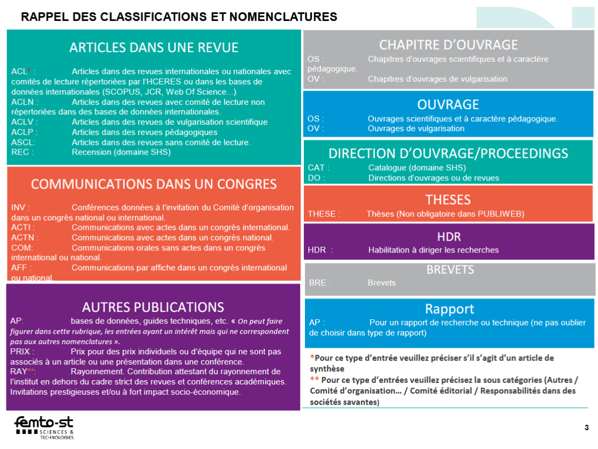

# Steps to do when you've published a preprint or a paper

## Update the neuro-group website

https://neuro-team-femto.github.io/publications/

## fill a new entry in publiweb

- Create a Publiweb Ticket per publication on [https://tickets.femto-st.fr](https://tickets.femto-st.fr)

- Tutorial: [https://publiweb.femto-st.fr/tntnet/pdf/memo-publiweb.pdf](https://publiweb.femto-st.fr/tntnet/pdf/memo-publiweb.pdf). 

- In particular, here's a list of acronyms used to identify article types in your ticket

<figure markdown>
  { width="80%" }
 </figure>

- normally the entry gets automatically published in publiweb (e.g. in your FEMTO profile page) + in HAL a few days later

!!! note

    Add your funders' information in the ticket, especially for ANR funding (ask JJ) which publications are automatically mined from HAL.
 
